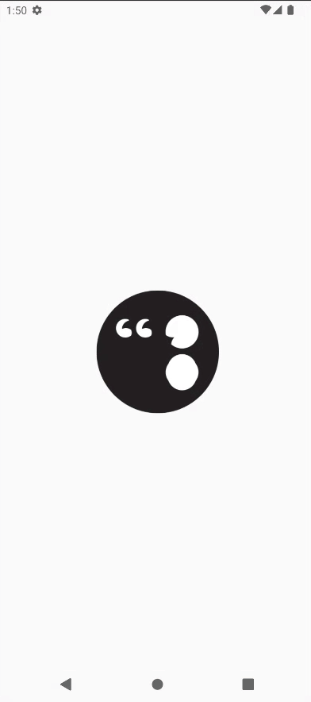
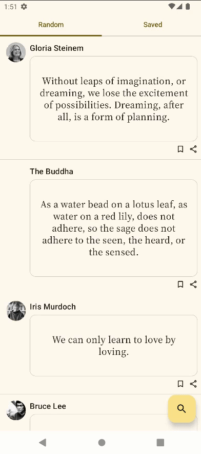
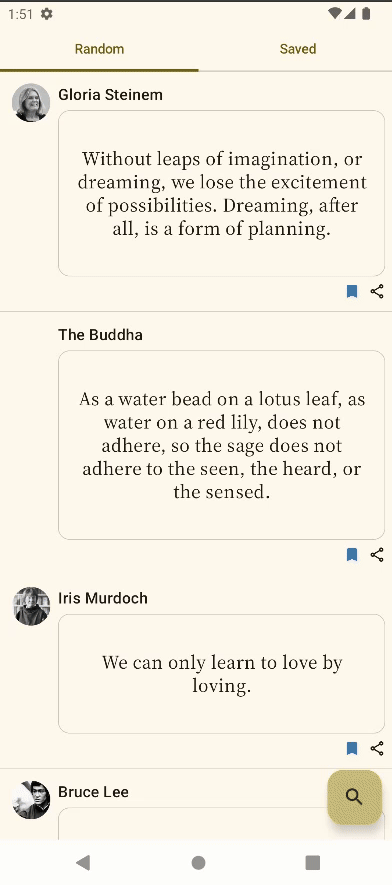

# <h1 align="center">❝❞ InspireMe (Quotations App)</h1>
InspireMe is an app built with Kotlin and Jetpack Compose, using data from Quotable—an open-source quotations API. The app displays random quotes from various authors, aiming to inspire and uplift.

👉 Check out the [Quotable open-source API GitHub Repo](https://github.com/lukePeavey/quotable?tab=readme-ov-file)

## 🖼️ Preview

Splash Screen | Quotations List | Search
------------- | --------------- | -----------
 |  | 

## ✨ Features
- Displays random quotations along with the author's name and picture
- Allows users to save and share their favorite quotes
- Provides a search feature for finding specific quotes
- Categorizes quotes based on themes
- Pull to refresh

## 🚀 Getting Started 
To use the app, you can either download it from the release section or run it from [Android Studio.](https://developer.android.com/studio?gad_source=1&gclid=CjwKCAjwnei0BhB-EiwAA2xuBvd_0mB3xf_7iU7r0s6-lG0XGMH00_pR8-tJ6iMkQUIIU3wZMb8euRoCaIYQAvD_BwE&gclsrc=aw.ds)

If you choose to run the app in Android Studio:
- Clone this repository: https://github.com/minick-nick/InspireMe
- Open the project in Android Studio
- Build and run the app

## 🛠️ Tech Stack
- Retrofit
- Room
- Navigation
- Flows
- Coil
- Coroutines
- KotlinX Serialization

# License
```xml
Designed and developed by 2024 Dominic Dofredo 

Licensed under the Apache License, Version 2.0 (the "License");
you may not use this file except in compliance with the License.
You may obtain a copy of the License at

   http://www.apache.org/licenses/LICENSE-2.0

Unless required by applicable law or agreed to in writing, software
distributed under the License is distributed on an "AS IS" BASIS,
WITHOUT WARRANTIES OR CONDITIONS OF ANY KIND, either express or implied.
See the License for the specific language governing permissions and
limitations under the License.